# 论文图表 Mermaid 代码
# 渲染命令：npx @mermaid-js/mermaid-cli --input xxx.mmd --output xxx.png --scale 4

# ============================================================
# 图1 系统逻辑架构图（第4章 4.1 总体架构）
# ============================================================
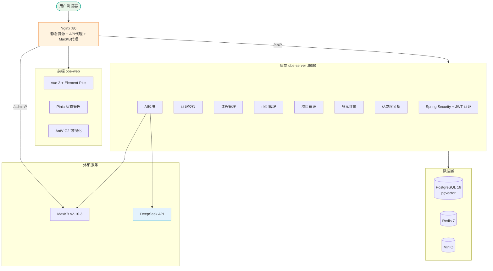

# ============================================================
# 图2 系统部署架构图（第4章 4.1 总体架构）
# ============================================================
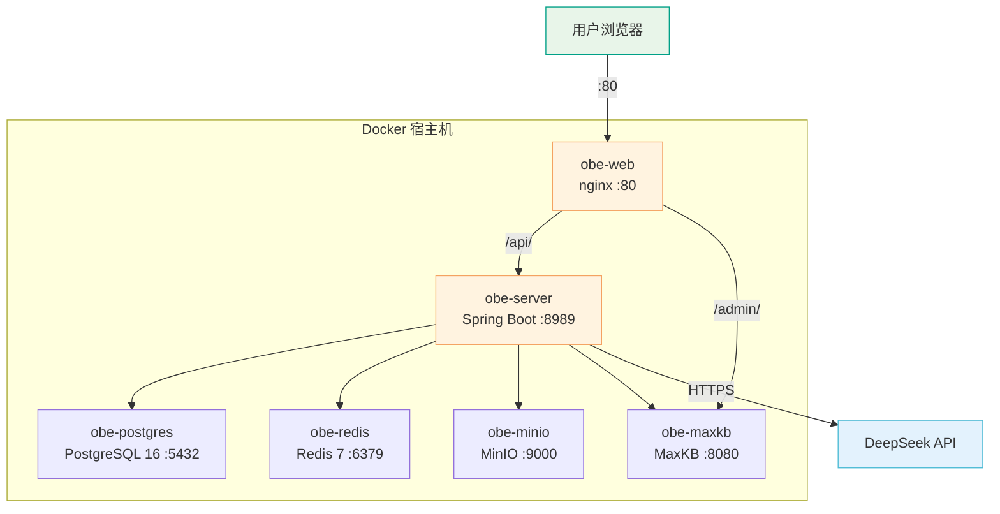

# ============================================================
# 图3 用户与认证模块ER图（第4章 4.3 数据库设计）
# ============================================================
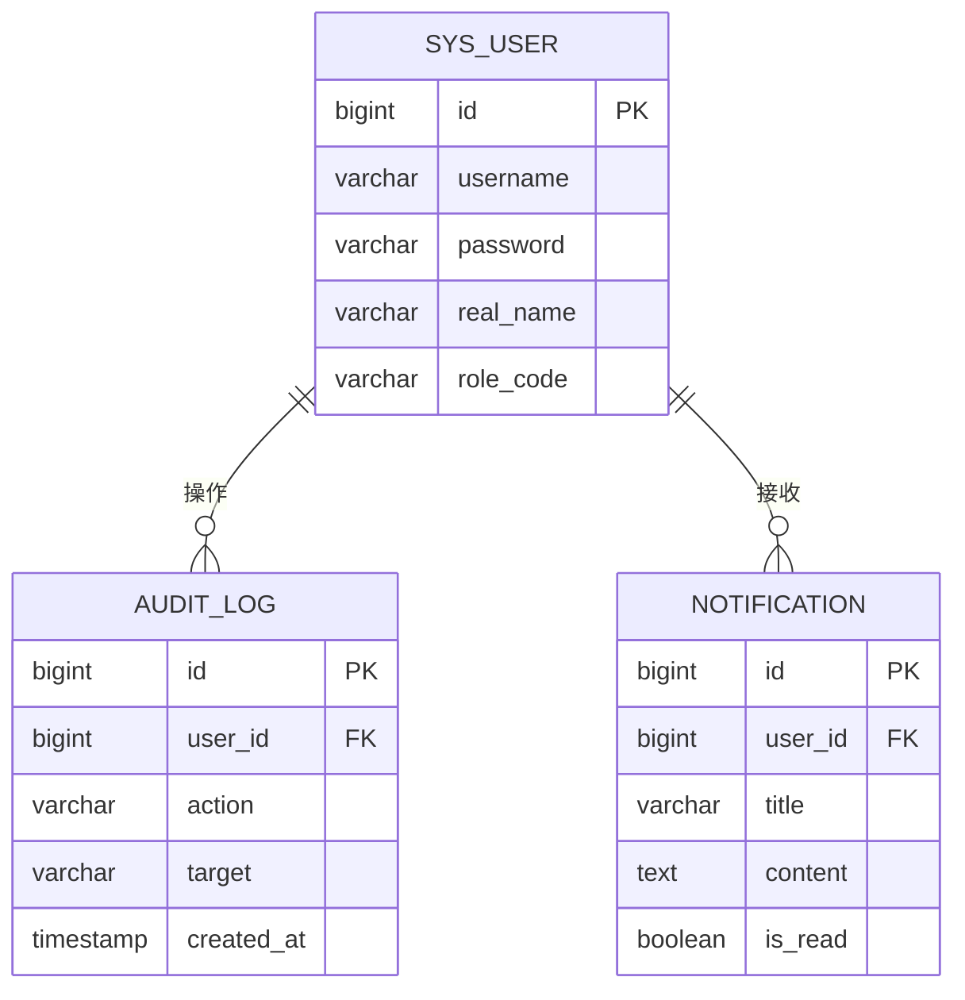

# ============================================================
# 图4 OBE评价体系ER图（第4章 4.3 数据库设计）
# ============================================================
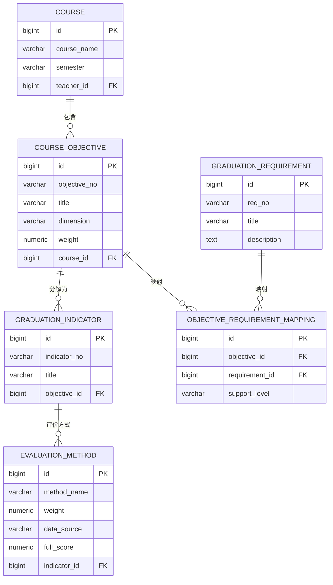

# ============================================================
# 图5 小组与成员模块ER图（第4章 4.3 数据库设计）
# ============================================================
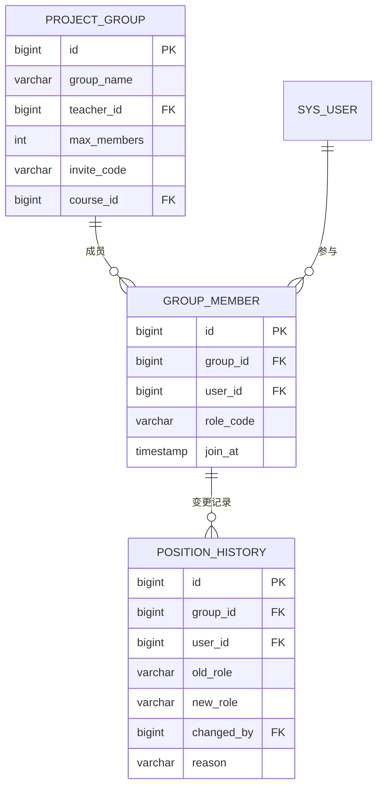

# ============================================================
# 图6 项目追踪模块ER图（第4章 4.3 数据库设计）
# ============================================================
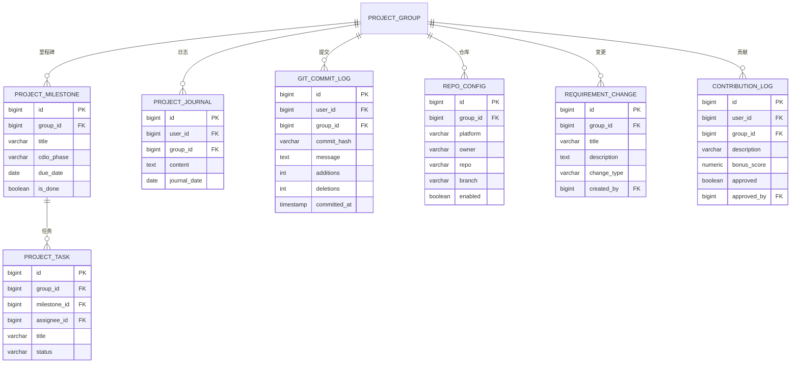

# ============================================================
# 图7 评价与成绩模块ER图（第4章 4.3 数据库设计）
# ============================================================
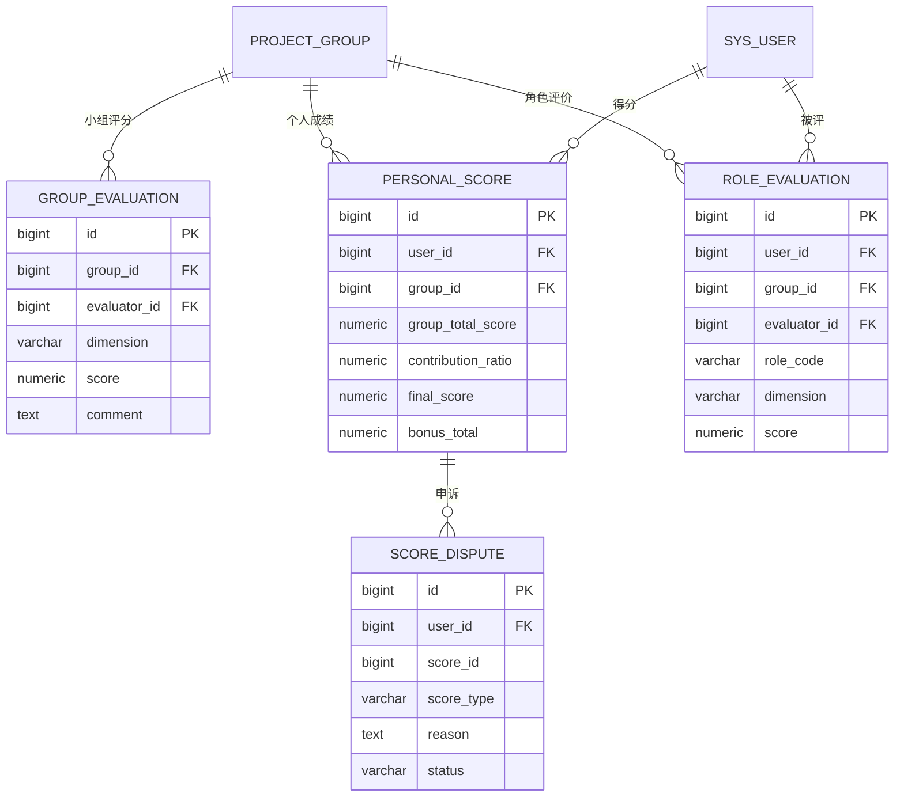

# ============================================================
# 图8 AI与知识库模块ER图（第4章 4.3 数据库设计）
# ============================================================
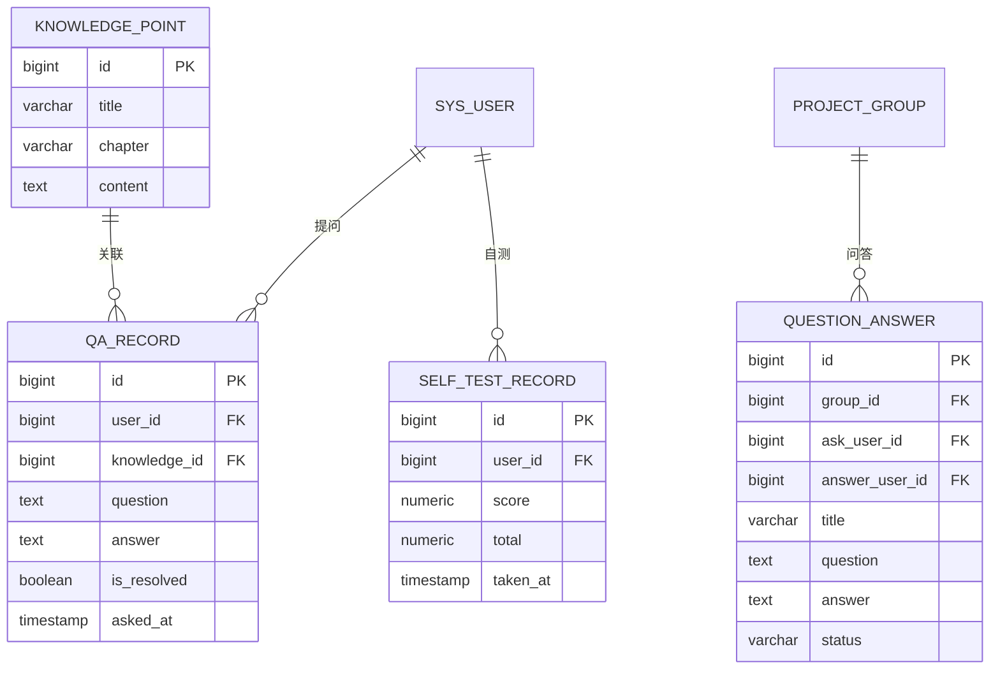

# ============================================================
# 图9 数据采集阶段流程图（第4章 4.2.4 多元过程性评价）
# ============================================================
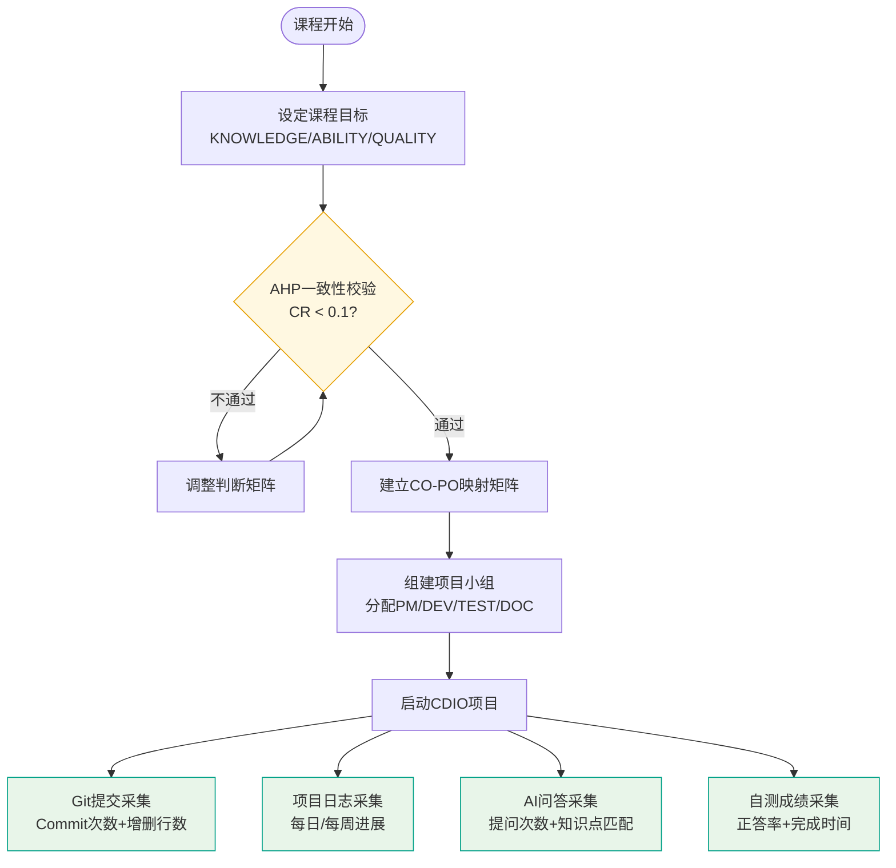

# ============================================================
# 图10 贡献度计算流程图（第4章 4.2.4 多元过程性评价）
# ============================================================
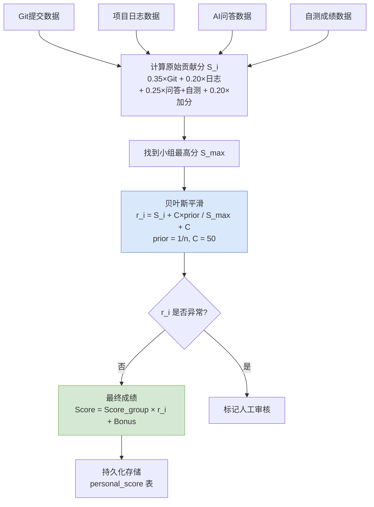

# ============================================================
# 图11 达成度分析流程图（第4章 4.2.4 多元过程性评价）
# ============================================================
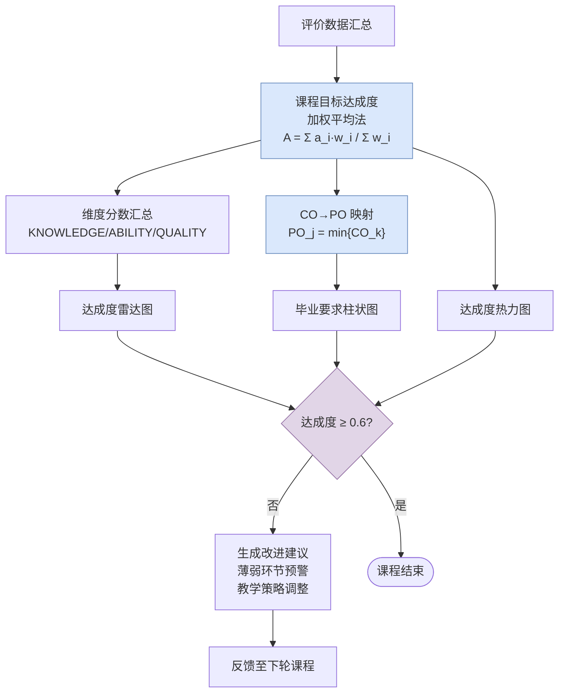
